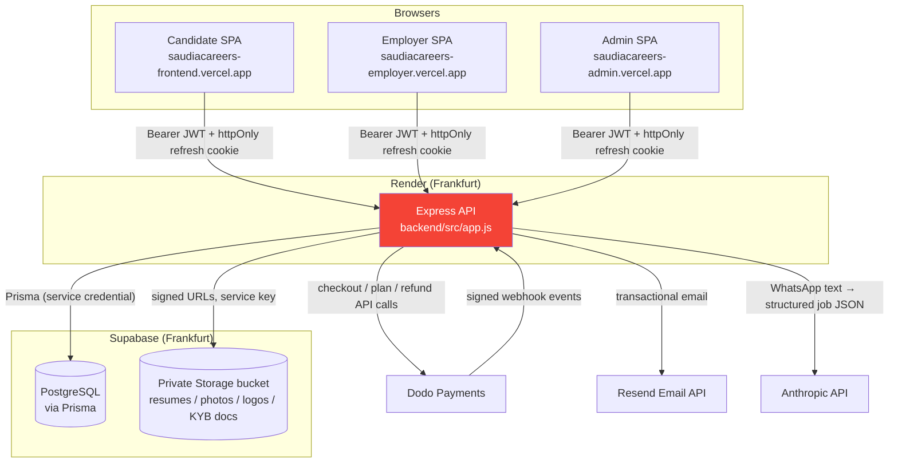
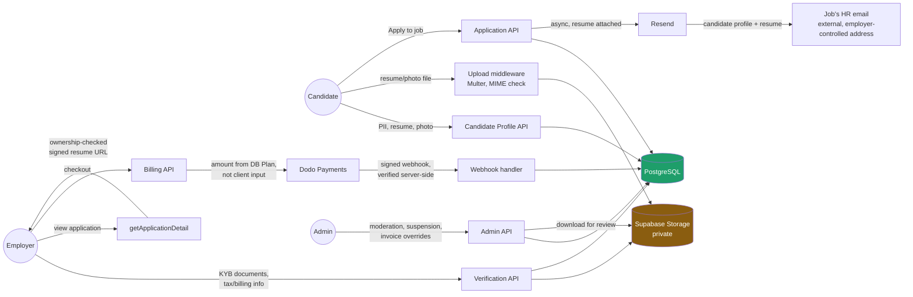

# System Architecture

**System:** SaudiaCareers — job portal for the Saudi Arabian / GCC market.
**Reviewed:** repository at `D:\SaudiaCareers`, branch `billing_and_payment` (current HEAD at time of review).

## 1. Repository structure

Single npm workspace monorepo:

```
SaudiaCareers/
├── backend/     Express 4 REST API (Node ≥20, ESM)
│   ├── prisma/          schema.prisma + migrations + seed scripts
│   └── src/
│       ├── controllers/ 18 controllers (see 02-attack-surface.md)
│       ├── routes/      11 route files, mounted in app.js
│       ├── middleware/  authenticate, authorizeAdmin (role gates), validate (Zod), rateLimiter, upload (Multer), errorHandler
│       ├── services/    email, storage, tokens, Dodo payments, notifications, job-expiry, job-legitimacy, resume/AI parsing
│       ├── validation/  one Zod schema file per domain
│       └── utils/       ApiError, ApiResponse, asyncHandler
├── frontend/    React 18 + Vite SPA, Zustand state, Axios client, React Router v6
│   └── src/pages/{public,auth,candidate,employer,admin}, api/, store/, routes/ (route guards)
├── render.yaml           Render (backend) deploy config — the only IaC in the repo
└── (no Dockerfile, no docker-compose, no .github/ workflows)
```

There is **no CI/CD pipeline** in this repository (`.github/` does not exist). Deploys are git-push-triggered auto-deploys on Vercel (frontend) and Render (backend), with no automated test gate, lint gate, or security scan enforced before a deploy ships. This is a standing gap noted throughout this audit rather than repeated per-finding.

## 2. Deployed topology (from `PROGRESS.md`, not independently verified against live infrastructure)

One backend codebase, one frontend codebase, deployed multiple times:

- **Backend:** one Render web service (Frankfurt region), one PostgreSQL database (Supabase, Frankfurt) accessed via Prisma over a PgBouncer transaction-mode pooler (`DATABASE_URL`) and a direct connection for migrations (`DIRECT_URL`).
- **Frontend:** the *same* unmodified React bundle deployed to **three separate Vercel projects** (candidate, employer, admin), differentiated only by a client-side hostname check (`PortalHome.jsx`) that picks the landing page. All three call the same backend host. This means role separation between portals is a UX convenience, not a security boundary — the real boundary is server-side role checks (see `05-authorization-matrix.md`).
- **Storage:** one private Supabase Storage bucket (`SaudiaCareers`) holding resumes, avatars, employer logos, and KYB verification documents, accessed only via short-lived signed URLs (server-mediated, see `04-findings.md` for the upload/download review).
- **Payments:** Dodo Payments (hosted checkout + webhooks) for employer subscriptions and job-posting credit packs. No cardholder data is stored in this application's own database (see `EmployerPaymentMethod` — stores only `gatewayPaymentMethodId`, brand, and last-4, all non-sensitive display metadata; the actual payment method is held by Dodo).
- **Email:** Resend, transactional only (welcome, password reset, application/HR notifications, status changes).
- **AI:** Anthropic API, used only for one feature — parsing pasted WhatsApp job-posting text into structured draft job listings for admin review.

## 3. Authentication architecture

- Password auth only (no OAuth/social login, no MFA anywhere, including the admin portal).
- **Access token:** short-lived JWT (HS256, `JWT_ACCESS_SECRET`), sent as a `Bearer` token in the `Authorization` header, held in Zustand **memory only** on the frontend (not `localStorage`) — deliberate XSS-token-theft mitigation per project convention.
- **Refresh token:** JWT (HS256, `JWT_REFRESH_SECRET`, separate secret from the access token), stored **hashed** (SHA-256) in the `RefreshToken` table, delivered to the browser only via an `httpOnly` cookie scoped to `path: /api/auth`, with `secure: true` + `SameSite=None` in production. Refresh is **rotating with reuse detection**: each use revokes the old token and issues a new one; presenting an already-revoked token revokes *every* session for that user and logs a `[SECURITY]` server-side alert (`tokenService.js:64-91`). This is a stronger implementation than most MVPs ship with.
- Three roles (`CANDIDATE`, `ADMIN`, `EMPLOYER`) gated by three separate Express middlewares (`authorizeAdmin`, `authorizeCandidate`, `authorizeEmployer`), each a simple `req.user.role === X` check run after `authenticate` has verified the JWT and loaded the current user from the database (so a deleted/role-changed user is caught on the next request — no stale-role window beyond the 15-minute access-token lifetime).
- Seeded admin account is forced through a password-change flow before reaching the admin dashboard (`requirePasswordChangeComplete`).

## 4. Data stores

| Store | Contents | Access pattern |
|---|---|---|
| PostgreSQL (Supabase, via Prisma) | All relational data — 24 models: users, candidate/employer profiles (including sensitive fields: nationality, gender, date of birth, marital status, religion, visa status), jobs, applications, invoices/transactions, KYB verification documents (metadata + storage path), notifications, refresh tokens (hashed), password-reset tokens (hashed) | Server-only, via Prisma Client using a single service-level connection string. Frontend never talks to Postgres directly. |
| Supabase Storage (private bucket) | Resume files, profile photos, employer logos, KYB verification PDFs | Server-mediated only — upload via backend endpoint (Multer → memory → Supabase), download via backend-generated signed URL. No public bucket access. |
| Browser: Zustand (memory) | Access token, current user object | Cleared on tab close / logout; not persisted. |
| Browser: `httpOnly` cookie | Refresh token (opaque to JS) | Not readable by frontend JS at all. |
| Browser: `localStorage` | Per-portal "remember me" email strings only (`admin_remember_email`, `emp_remember_email`, `candidate_remember_email`) — confirmed in deep-dive review, no tokens or passwords found here. | — |

## 5. External integrations

| Service | Purpose | Trust boundary |
|---|---|---|
| Dodo Payments | Checkout, subscriptions, refunds, webhooks | Webhook signature-verified against raw request body via the official SDK's `webhooks.unwrap()`; amounts always sourced from the verified event payload, never from client input (see `04-findings.md`). |
| Supabase | Postgres + private object storage | Backend holds the service-role key; RLS enforcement status not independently verifiable from the repo (see `10-open-questions.md`). |
| Resend | Transactional email | API key server-side only. |
| Anthropic API | WhatsApp-paste-to-job-listing parsing (admin-triggered import tool) | Output is Zod-validated as a normal job payload before persistence (see `04-findings.md`). |
| Vercel / Render | Hosting | No IaC beyond `render.yaml`; environment/IAM configuration lives entirely in each platform's dashboard, outside this repo's visibility. |

## 6. Trust boundaries (summary — full detail in `02-attack-surface.md` and `05-authorization-matrix.md`)

1. **Internet → public API** (`/api/jobs`, `/api/auth/*`, `/api/enquiries`, `/api/webhooks/dodo`) — unauthenticated, rate-limited only on `/api/auth/*`.
2. **Authenticated candidate → API** — Bearer token required; resource access should be self-scoped.
3. **Authenticated employer → API** — Bearer token + role check; resource access should be scoped to jobs/applications/billing records the employer owns (`createdBy` / `employerProfileId`).
4. **Authenticated admin → API** — Bearer token + role check; broadest access by design (moderation, billing overrides, employer suspension).
5. **Backend → Supabase Storage** — service-role trust, mediated entirely by backend logic; no direct client access.
6. **Dodo → backend webhook** — the only unauthenticated-by-JWT endpoint that mutates billing state; trust is established by HMAC signature instead of a session.
7. **Backend → Anthropic** — outbound only, one-directional, admin-triggered.

## 7. Architecture diagram



## 8. Data-flow diagram — sensitive data



## 9. Notable architectural facts relevant to security posture

- **No CI/CD** means no repo-enforced test/lint/security gate before deploy — this is a gap tracked in `06-compliance-gap-analysis.md` and `07-remediation-roadmap.md`, not a vulnerability in application code per se.
- **Three Vercel projects sharing one backend** means the refresh-token cookie is not portal-scoped at the cookie level — session context can "leak" across portals in terms of the browser holding a cookie, though role enforcement remains server-side (documented as an accepted, previously-identified limitation in `PROGRESS.md`, re-verified in this audit's CORS/cookie finding — see `04-findings.md`).
- **No RLS-dependent database access** — the app is a traditional server-mediated architecture (Prisma + service credential), not a Supabase-client-in-the-browser architecture, so the entire "verify Supabase RLS rules" concern from generic audit checklists does not apply the way it would for a Firebase/Supabase-direct app. Authorization is enforced in Express controllers, which is why `05-authorization-matrix.md` and the IDOR review are the highest-value part of this audit.
